## JavaWeb 在线考试系统

从数据库设计到现在的样例 用时2天  2021年6月17~18日  存在很多不足，等待下一版的完善

19号进行答辩，时间紧凑，没有对文件整理。

第一次使用 IDEA git 上传项目到 GitHub

---

### 数据库设计

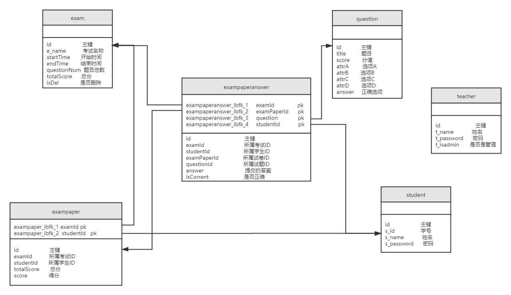

管理员登录尚未编写， 只能进行老师登录 或学生登录

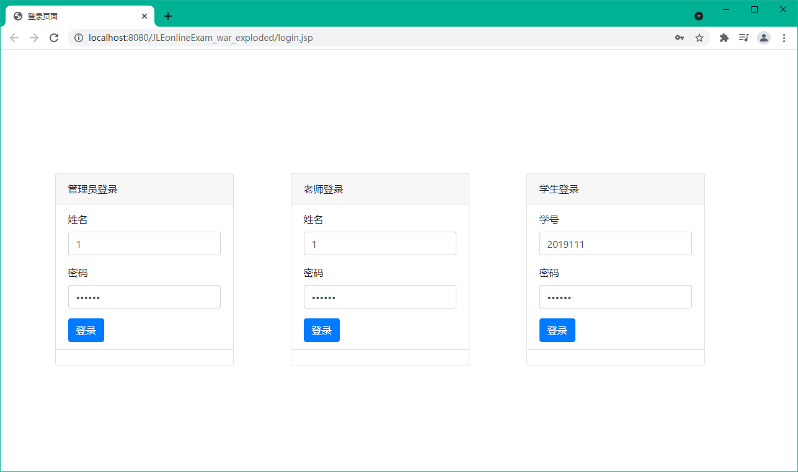

### 学生登录

- 学生登录主页

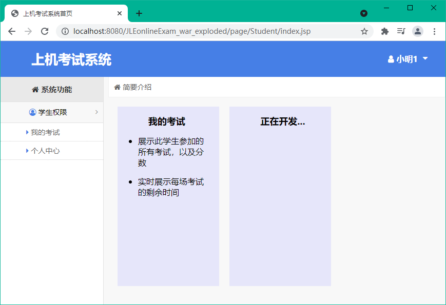

- 我的考试

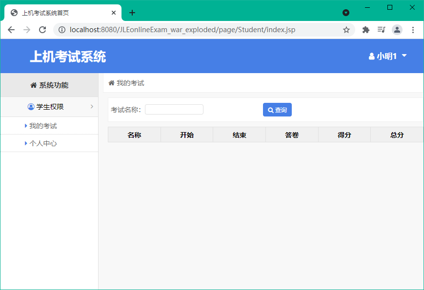

**组卷后**

- 我的考试

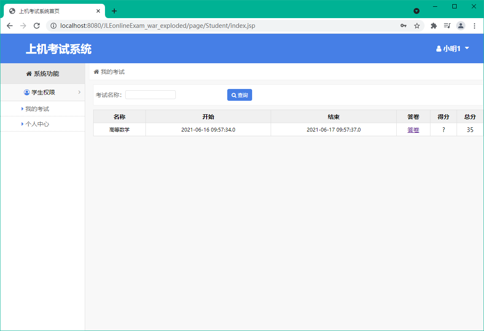

- 答题界面（红色框中等功能尚未完善）

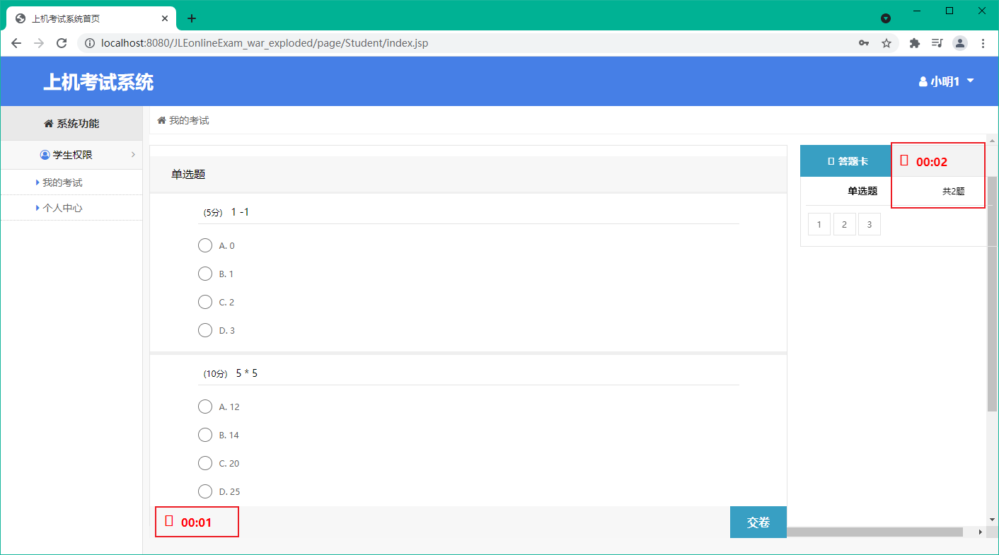

### 老师登录

- 老师登录主页

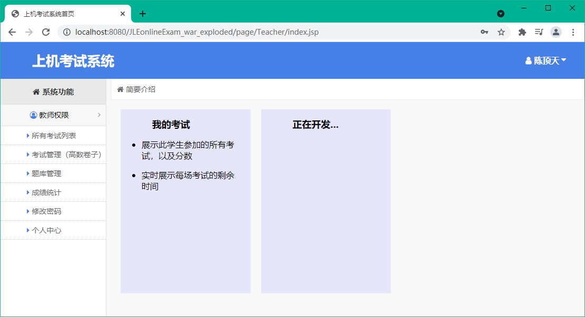

- 所有考试列表

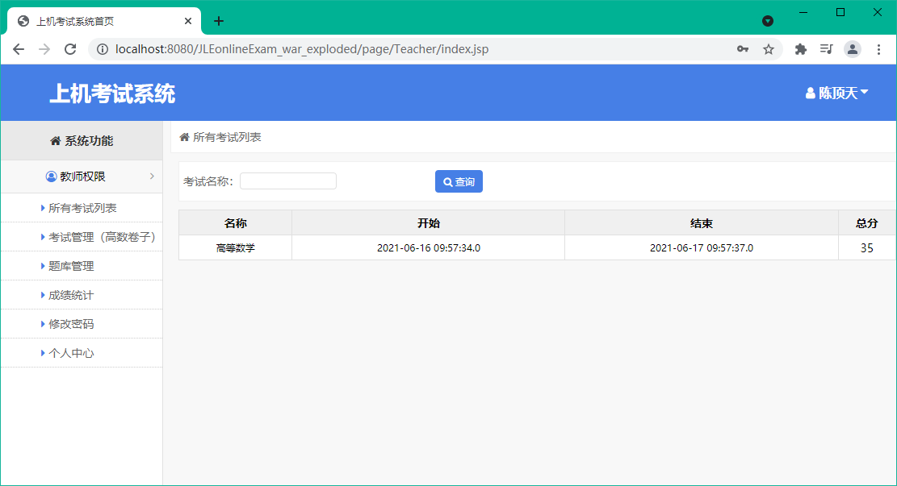

- 考试管理（高数卷子）（由于时间优先，考试管理的页面为默认的高数试题界面，作答没有时间等限制，默认为2个数据库中已经存在的两位考生，考试试题为数据库题库的全部试题（现数据库试题数：3题），在这里修改题目的同时，也修改了题库的题目。

  **点击该栏，此时系统已完成组卷。**

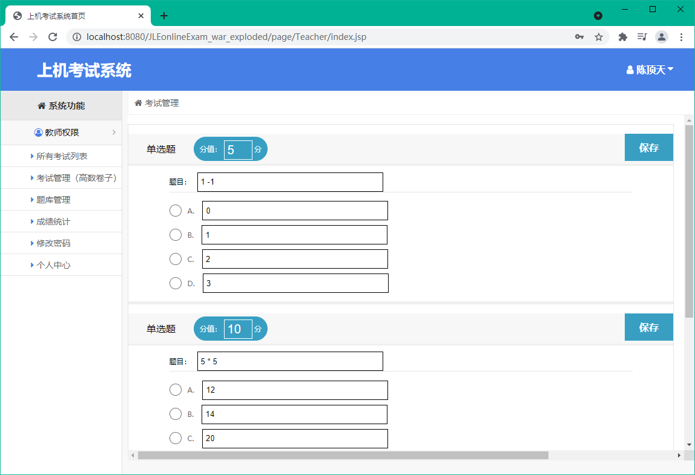

- 题库管理 （当前默认管理全部试题）

- 成绩统计（由于数据库中存在的2位考生尚未答题，所以均为0分）

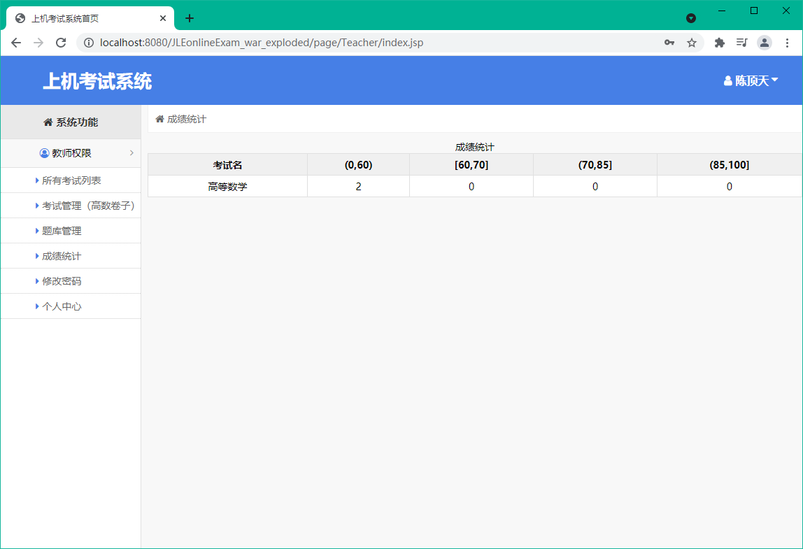

- 修改密码页面 尚未编写
- 个人中心

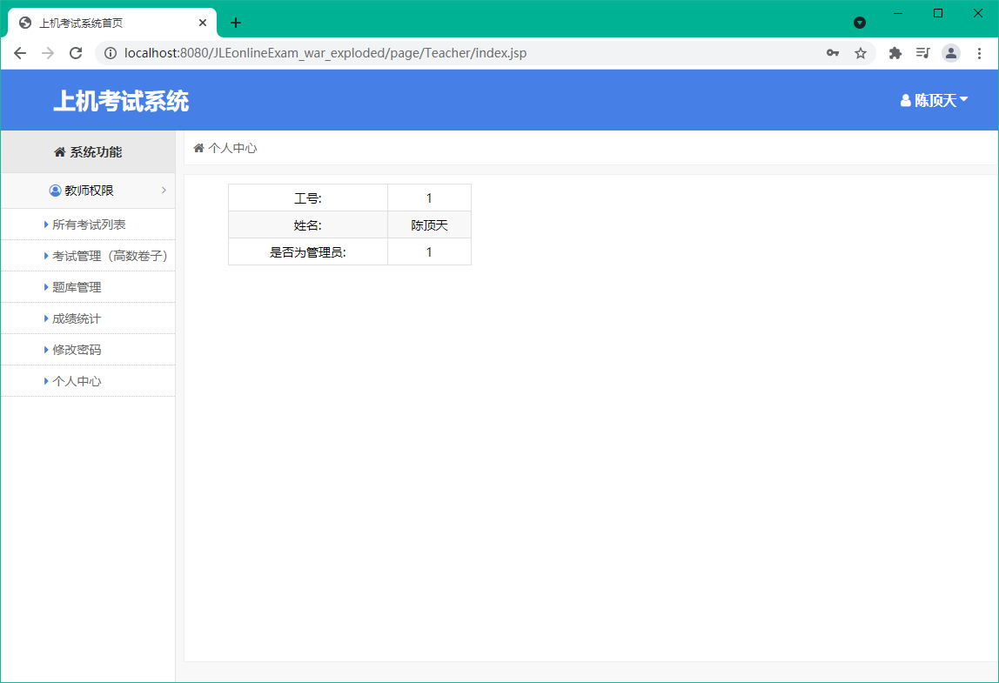

###  项目演示流程

1. 进行学生登录，查看考试列表，默认是没有考试信息
2. 进行老师登录，点击 **考试管理（高数卷子）** 完成组卷，同时可以修改题目
3. 重新进行学生登录，即可进行答题。

